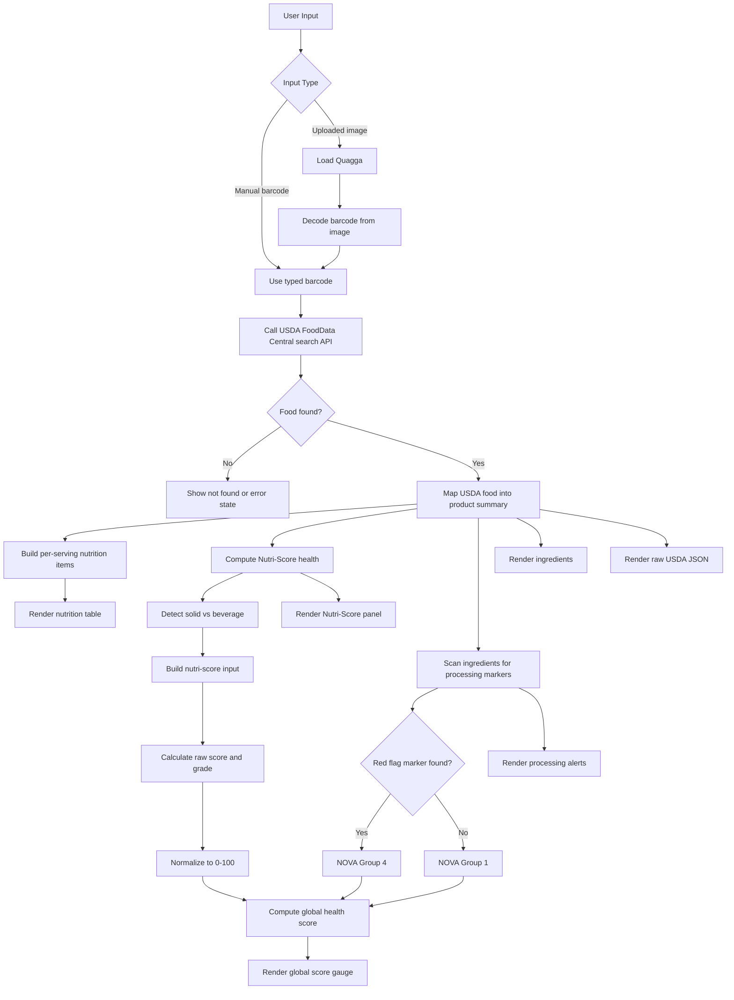

# App Logic Overview

## Purpose

This app looks up branded food products from USDA FoodData Central using a barcode, extracts nutrition and ingredient data, computes product health signals, and renders a consumer-friendly summary.

## High-Level Flow

1. The user enters a barcode manually or uploads an image containing a barcode.
2. If an image is uploaded, Quagga decodes the barcode in the browser.
3. The app calls the USDA FoodData Central search API with the barcode.
4. The first branded food result is mapped into a UI-friendly product model.
5. The app computes:
   - Per-serving nutrition values
   - Daily value percentages
   - Nutri-Score raw score, normalized score, and grade
   - NOVA-style processing detection from ingredient markers
   - A composite global health score
6. The UI renders the nutrition table, Nutri-Score panel, global health gauge, ingredient list, processing alerts, and raw USDA JSON.

## Main Modules

### `src/App.jsx`

Owns the user flow and rendering:

- Manages barcode input, image upload, loading, success, and error states
- Loads Quagga dynamically for barcode decoding
- Calls the USDA API
- Maps USDA food data into a product summary object
- Renders the nutrition, Nutri-Score, global score, ingredients, and raw data panels

### `src/utils/calculateProductHealth.js`

Computes the Nutri-Score-based nutrition health signal:

- Reads required nutrients from the USDA `foodNutrients` array
- Detects whether the product should be treated as a `solid` or `beverage`
- Builds the input expected by the `nutri-score` library
- Returns:
  - `input`
  - `score`
  - `normalizedScore`
  - `grade`
  - `foodType`

### `src/utils/calculateGlobalHealthScore.js`

Computes the composite health score:

- Scans the ingredient string for ultra-processed "red flag" markers
- Assigns:
  - `novaGroup = 4` if any marker is found
  - `novaGroup = 1` otherwise
- Uses the normalized Nutri-Score as the main score contribution
- Adds a smaller NOVA contribution so processing still matters without flattening differences between products in the same NOVA group
- Returns:
  - `totalScore`
  - `nutriScoreGrade`
  - `novaGroup`
  - `processedMarkersFound`
  - `nutriComponent`
  - `novaComponent`

## Data Model Summary

The mapped product object currently contains:

- Product identity:
  - name
  - brand
  - gtinUpc
- Serving/package info:
  - servingSizeText
  - servingSizeMetric
  - packageWeight
- Ingredients:
  - ingredients
- Nutrition display:
  - items
- Health analysis:
  - health
  - globalHealth

## Scoring Logic

### Nutri-Score Logic

- Pull nutrient values from USDA data
- Convert energy from kcal to kJ when needed
- Run the `nutri-score` package using the detected food type
- Normalize the raw score to a 0-100 scale for UI use

### NOVA-Like Processing Logic

- The ingredient string is lowercased
- The app searches for red-flag markers such as:
  - `high fructose corn syrup`
  - `maltodextrin`
  - `lecithin`
  - `flavor`
  - `artificial color`
  - `hydrogenated`
  - `pgpr`
  - `sucralose`
- If any marker matches, the product is treated as more processed

### Composite Global Health Logic

- Nutri-Score is the dominant component
- NOVA contributes an adjustment rather than fully determining the result
- This avoids a case where two ultra-processed products get the same global score despite different nutrition quality

## Mermaid Diagram

## Current UI Output

When a product is found, the app shows:

- Product metadata
- Amount-per-serving nutrition table
- Nutri-Score badge and technical input
- Global health gauge on a 0-100 scale
- Processing alerts based on ingredient markers
- Ingredient text
- Raw USDA JSON for debugging and iteration

## Current Constraints

- USDA search currently uses the first branded result only
- NOVA detection is heuristic and marker-based, not a full formal NOVA classifier
- Beverage detection is keyword and serving-unit based
- Ingredient text quality depends on USDA data completeness
